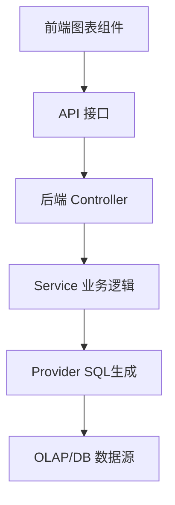

# DataEase 设计文档模板

## 概述

[功能的高级描述及其在 DataEase 系统中的位置。例如：在图表编辑器中新增“桑基图”类型，属于前端可视化组件扩展。]

## 指导文档对齐

### 技术标准 (tech.md)
[设计如何遵循 DataEase 的技术栈：Java 21, Spring Boot, Vue 3, TypeScript。]

### 项目结构 (structure.md)
[实现将如何遵循 `core-backend` 和 `core-frontend` 的目录结构。]

## 代码重用分析
[将利用、扩展或与此功能集成的现有代码]

### 要利用的现有组件
- **后端**：`EngineProvider` (SQL 生成), `ChartService` (图表数据查询)。
- **前端**：`BaseChart` (图表基类), `ChartEditor` (编辑器框架)。

### 集成点
- **API**：`/api/v1/chart/data` (现有的图表数据接口是否需要修改？)
- **数据库**：`chart_view` 表 (是否需要新增字段？)

## 架构

[描述功能的整体架构。如果是新图表，描述前端渲染逻辑和后端数据处理逻辑。]

### 模块化设计原则
- **后端**：Service 层负责业务逻辑，Provider 层负责 SQL 适配。
- **前端**：View 层负责展示，Store 层负责状态，Hook 负责逻辑复用。



## 组件和接口

### 组件 1 (前端)
- **文件路径：** `core/core-frontend/src/views/chart/components/...`
- **目的：** [负责渲染 X 图表]
- **接口：** [Props: option, data; Emits: click, resize]
- **依赖：** [ECharts / AntV]

### 组件 2 (后端)
- **文件路径：** `core/core-backend/src/main/java/io/dataease/...`
- **目的：** [处理 X 图表的数据请求]
- **接口：** [Method: getData(ChartRequest)]
- **依赖：** [EngineProvider]

## 数据模型

### 数据库变更
```sql
-- 如果需要修改数据库，请在此处列出 DDL
ALTER TABLE chart_view ADD COLUMN ...
```

### 接口 DTO
```java
public class ChartRequest {
    private String chartType;
    private List<Dimension> dimensions;
    // ...
}
```

## 错误处理

### 错误场景
1. **场景 1：** 数据源连接失败
   - **处理：** 后端捕获异常，返回错误码 `DATA_SOURCE_ERROR`。
   - **用户影响：** 前端图表区域显示“数据源连接失败”的空状态页。

2. **场景 2：** SQL 语法错误
   - **处理：** 记录详细日志，返回通用查询错误。
   - **用户影响：** 提示“查询执行失败，请检查字段配置”。

## 测试策略

### 单元测试
- **后端**：测试 Service 层的 SQL 生成逻辑是否正确。
- **前端**：测试组件在不同数据下的渲染是否正常。

### 集成测试
- 验证从前端配置 -> 后端查询 -> 数据库执行 -> 数据返回 -> 图表渲染的完整链路。

### 端到端测试
- 使用 Cypress/Selenium 模拟用户创建图表的操作流程。
