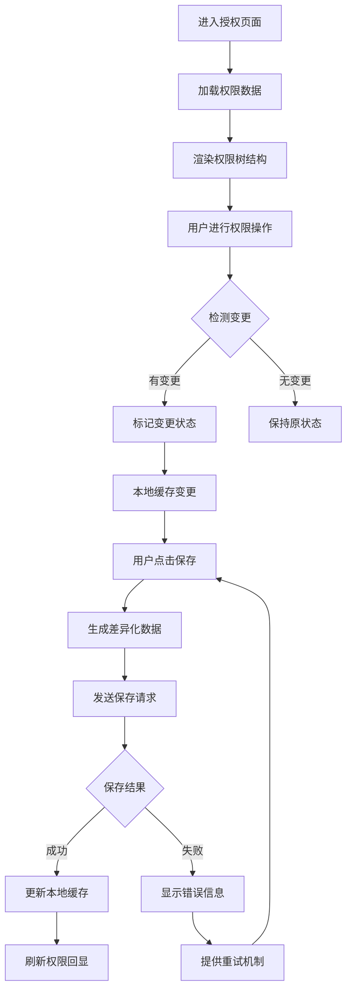
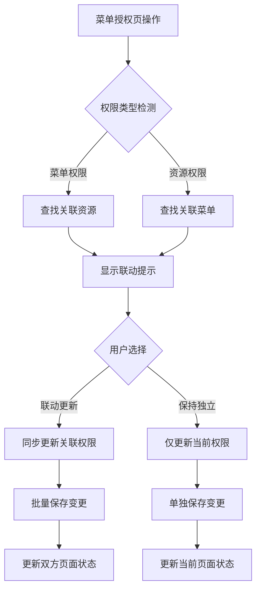
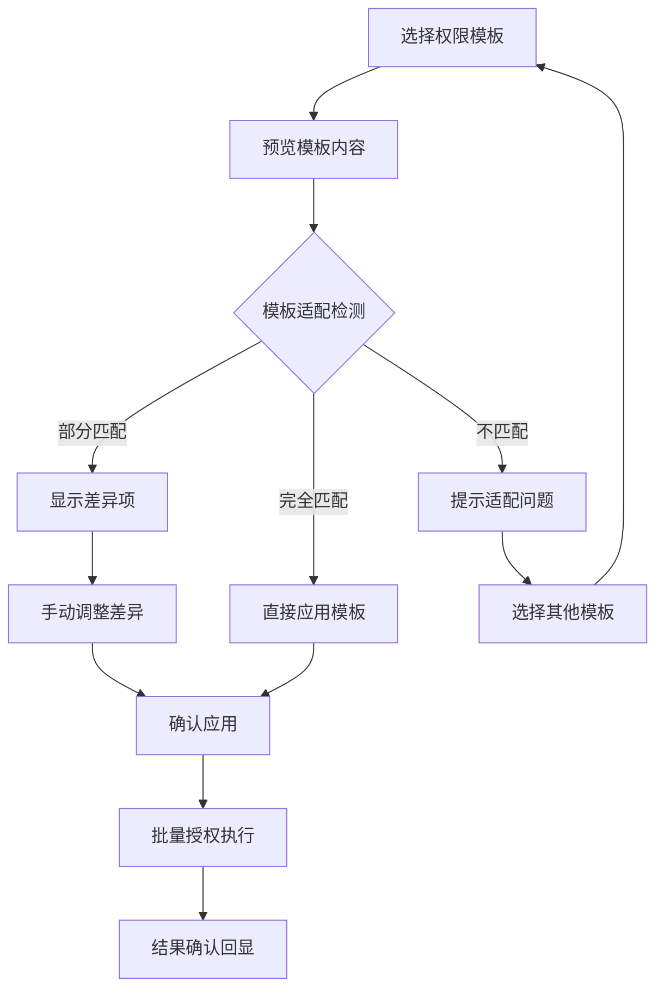

## 1. 产品概述

DataEase权限管理系统前端授权页的保存/回显闭环功能，以及菜单授权页与资源授权页的交互协同机制。解决权限配置过程中的用户体验问题，提升权限管理效率和准确性。

面向系统管理员和权限管理员，提供直观、高效的权限配置界面，支持批量操作和智能联动。

## 2. 核心功能

### 2.1 用户角色

| 角色 | 注册方式 | 核心权限 |
|------|----------|----------|
| 超级管理员 | 系统初始化创建 | 所有权限，包括系统配置、用户管理、角色管理、所有资源权限 |
| 权限管理员 | 超级管理员分配 | 角色管理、权限分配、权限模板管理、权限审计 |
| 普通管理员 | 超级管理员分配 | 指定范围内的用户管理、资源权限分配 |
| 普通用户 | 自助注册/管理员创建 | 根据分配的角色享有相应权限 |

### 2.2 功能模块

权限管理系统包含以下核心页面：

1. **角色管理页**：角色列表、角色创建、权限配置、成员管理
2. **菜单授权页**：菜单树形结构、权限勾选、批量操作、联动配置
3. **资源授权页**：资源分类管理、资源权限分配、批量授权、差异化配置
4. **权限模板页**：模板创建、模板应用、模板管理、快速授权
5. **权限审计页**：权限变更记录、操作日志、权限分析

### 2.3 页面详情

| 页面名称 | 模块名称 | 功能描述 |
|----------|----------|----------|
| 菜单授权页 | 树形菜单展示 | 支持懒加载的分页树结构，动态加载子菜单，支持搜索和过滤 |
| 菜单授权页 | 权限勾选 | 支持级联勾选/取消，父子节点权限联动，半选状态显示 |
| 菜单授权页 | 批量操作 | 支持批量授权/取消授权，一键全选/反选，权限复制粘贴 |
| 菜单授权页 | 快捷联动 | 与资源授权页实时联动，菜单权限变更自动同步相关资源权限 |
| 资源授权页 | 资源分类树 | 支持多类型资源（报表、数据集、仪表板等）的分层展示 |
| 资源授权页 | 差异化保存 | 只保存变更的权限项，支持增量更新，提供变更预览 |
| 资源授权页 | 撤销/回滚 | 支持操作撤销，权限变更历史记录，一键回滚到指定版本 |
| 资源授权页 | 并发控制 | 权限编辑锁定机制，避免并发冲突，支持强制覆盖和合并策略 |
| 权限模板页 | 模板管理 | 创建、编辑、删除权限模板，支持模板分类和标签管理 |
| 权限模板页 | 快速应用 | 一键应用权限模板到角色或用户，支持模板自定义调整 |

## 3. 核心流程

### 3.1 前端授权页保存/回显闭环流程

### 3.2 菜单授权与资源授权交互协同流程

### 3.3 权限模板应用流程

## 4. 用户界面设计

### 4.1 设计规范

- **主色调**：#1890ff（蓝色）表示可操作权限，#52c41a（绿色）表示已授权状态
- **辅助色**：#faad14（橙色）表示警告，#f5222d（红色）表示错误
- **按钮样式**：圆角矩形，主要操作为实心主色调，次要操作为边框样式
- **字体规范**：14px为主文本，12px为辅助文本，16px为标题
- **布局风格**：卡片式布局，左右分栏结构，树形结构采用缩进层级

### 4.2 页面布局设计

| 页面 | 模块 | UI元素 |
|------|------|--------|
| 菜单授权页 | 左侧菜单树 | 分页加载的树形控件，支持搜索框、展开/收起全部，节点显示图标和名称，权限状态用彩色标签表示 |
| 菜单授权页 | 右侧详情面板 | 显示选中菜单的详细信息、关联资源列表、权限变更历史，提供快速操作按钮 |
| 资源授权页 | 资源分类导航 | 顶部标签页切换不同类型资源，左侧分类树支持懒加载，右侧列表支持分页 |
| 资源授权页 | 批量操作栏 | 顶部工具栏包含全选、反选、复制权限、粘贴权限、撤销、重做等操作按钮 |
| 权限模板页 | 模板列表 | 网格布局展示模板卡片，显示模板名称、描述、适用范围、创建时间，支持快速搜索 |

### 4.3 交互细节

1. **懒加载体验**：节点展开时显示加载动画，加载完成后平滑展开
2. **权限变更提示**：实时显示变更数量，重要操作需要二次确认
3. **错误处理**：网络错误显示友好提示，支持离线缓存和重试
4. **加载状态**：全局加载遮罩，局部加载动画，操作按钮禁用状态

### 4.4 响应式设计

- **桌面端**：优先设计，充分利用屏幕空间，支持多窗口操作
- **平板端**：适配横竖屏切换，保持核心功能完整
- **移动端**：简化界面，重点功能优先，支持手势操作

## 5. 技术实现要点

### 5.1 前端状态管理

- 使用Pinia进行权限状态管理，分离权限数据、UI状态、操作历史
- 实现权限操作的命令模式，支持撤销/重做功能
- 采用差异检测算法，只传输变更数据，减少网络开销

### 5.2 并发控制机制

- 实现基于时间戳的乐观锁机制，处理并发编辑冲突
- 提供冲突检测和解决策略，支持自动合并和手动选择
- 权限编辑时加锁，防止多人同时编辑造成数据不一致

### 5.3 性能优化

- 树形结构采用虚拟滚动，支持大数据量展示
- 权限变更使用防抖技术，避免频繁请求
- 实现权限缓存机制，减少重复数据加载

### 5.4 数据一致性

- 前端实现权限数据的版本控制，支持回滚到任意历史版本
- 后端提供幂等性保证，确保重复操作不会产生副作用
- 实现权限操作的审计日志，完整记录所有变更历史