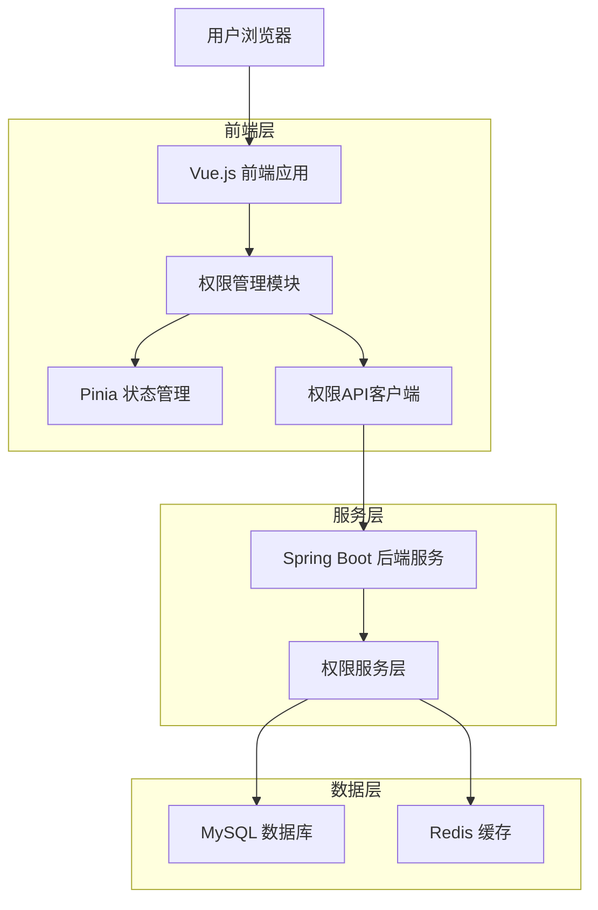
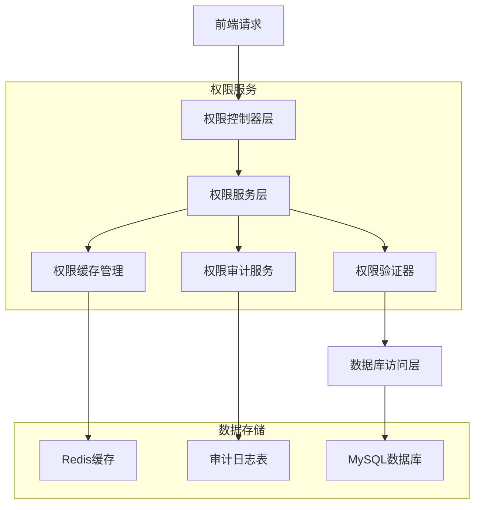
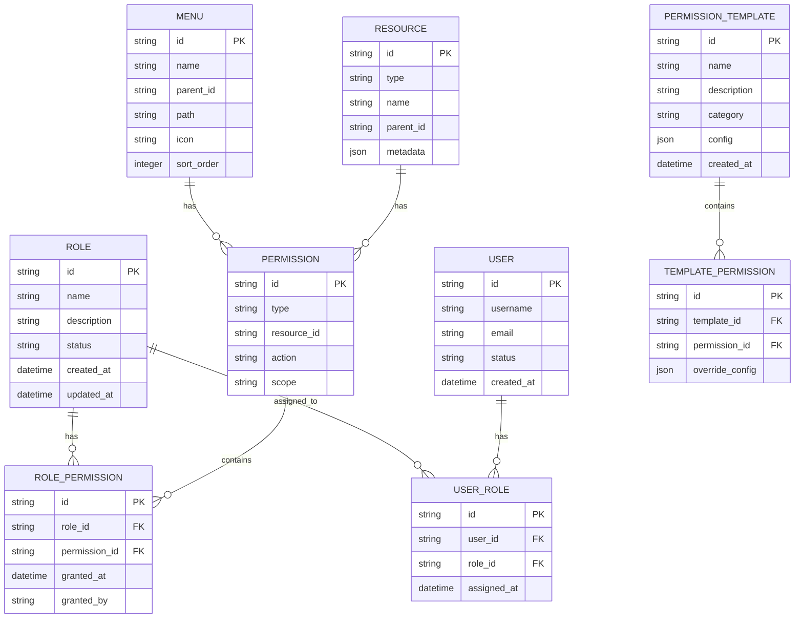

## 1. 架构设计



## 2. 技术描述

- **前端框架**: Vue.js 3 + Element Plus + Vite
- **状态管理**: Pinia
- **UI组件库**: Element Plus
- **构建工具**: Vite
- **后端框架**: Spring Boot 3.3 + Java 21
- **数据库**: MySQL 8.0
- **缓存**: Redis
- **权限认证**: JWT Token

## 3. 路由定义

| 路由 | 用途 |
|------|------|
| /permissions/roles | 角色管理页面，管理角色列表和基本信息 |
| /permissions/menu | 菜单授权页面，配置角色的菜单访问权限 |
| /permissions/resource | 资源授权页面，配置角色的资源操作权限 |
| /permissions/templates | 权限模板页面，管理权限模板 |
| /permissions/audit | 权限审计页面，查看权限变更历史 |
| /permissions/sync | 权限同步页面，处理权限同步任务 |

## 4. API 定义

### 4.1 权限查询API

```
GET /api/permissions/menu/{roleId}
```

请求参数：
| 参数名 | 类型 | 必需 | 描述 |
|--------|------|------|------|
| roleId | string | true | 角色ID |

响应：
```json
{
  "code": 200,
  "data": {
    "menus": [
      {
        "id": "menu_001",
        "name": "系统管理",
        "parentId": null,
        "hasPermission": true,
        "children": [
          {
            "id": "menu_001_01",
            "name": "用户管理",
            "parentId": "menu_001",
            "hasPermission": true,
            "children": []
          }
        ]
      }
    ]
  }
}
```

### 4.2 权限更新API

```
POST /api/permissions/menu/update
```

请求：
```json
{
  "roleId": "role_001",
  "changes": [
    {
      "menuId": "menu_001_01",
      "action": "grant"
    },
    {
      "menuId": "menu_001_02",
      "action": "revoke"
    }
  ],
  "timestamp": 1709097600000
}
```

响应：
```json
{
  "code": 200,
  "data": {
    "success": true,
    "conflicts": [],
    "version": 2
  }
}
```

### 4.3 批量授权API

```
POST /api/permissions/batch/grant
```

请求：
```json
{
  "roleIds": ["role_001", "role_002"],
  "resources": [
    {
      "type": "menu",
      "ids": ["menu_001", "menu_002"]
    },
    {
      "type": "report",
      "ids": ["report_001", "report_002"]
    }
  ],
  "templateId": "template_001"
}
```

## 5. 服务器架构图



## 6. 数据模型

### 6.1 权限相关实体关系图



### 6.2 数据定义语言

```sql
-- 角色表
CREATE TABLE sys_role (
    id VARCHAR(32) PRIMARY KEY,
    name VARCHAR(100) NOT NULL UNIQUE,
    description TEXT,
    status VARCHAR(20) DEFAULT 'active',
    created_at TIMESTAMP DEFAULT CURRENT_TIMESTAMP,
    updated_at TIMESTAMP DEFAULT CURRENT_TIMESTAMP ON UPDATE CURRENT_TIMESTAMP,
    created_by VARCHAR(32),
    updated_by VARCHAR(32),
    INDEX idx_role_status (status),
    INDEX idx_role_created_at (created_at)
);

-- 权限表
CREATE TABLE sys_permission (
    id VARCHAR(32) PRIMARY KEY,
    type VARCHAR(50) NOT NULL COMMENT '权限类型: menu, resource, data',
    resource_id VARCHAR(100) NOT NULL COMMENT '资源ID',
    action VARCHAR(50) NOT NULL COMMENT '操作: view, create, update, delete',
    scope VARCHAR(200) COMMENT '作用域',
    created_at TIMESTAMP DEFAULT CURRENT_TIMESTAMP,
    UNIQUE KEY uk_permission (type, resource_id, action),
    INDEX idx_permission_type (type),
    INDEX idx_permission_resource (resource_id)
);

-- 角色权限关联表
CREATE TABLE sys_role_permission (
    id VARCHAR(32) PRIMARY KEY,
    role_id VARCHAR(32) NOT NULL,
    permission_id VARCHAR(32) NOT NULL,
    granted_at TIMESTAMP DEFAULT CURRENT_TIMESTAMP,
    granted_by VARCHAR(32),
    expires_at TIMESTAMP NULL,
    UNIQUE KEY uk_role_permission (role_id, permission_id),
    INDEX idx_role_permission_role (role_id),
    INDEX idx_role_permission_permission (permission_id),
    FOREIGN KEY (role_id) REFERENCES sys_role(id) ON DELETE CASCADE,
    FOREIGN KEY (permission_id) REFERENCES sys_permission(id) ON DELETE CASCADE
);

-- 用户角色关联表
CREATE TABLE sys_user_role (
    id VARCHAR(32) PRIMARY KEY,
    user_id VARCHAR(32) NOT NULL,
    role_id VARCHAR(32) NOT NULL,
    assigned_at TIMESTAMP DEFAULT CURRENT_TIMESTAMP,
    assigned_by VARCHAR(32),
    expires_at TIMESTAMP NULL,
    UNIQUE KEY uk_user_role (user_id, role_id),
    INDEX idx_user_role_user (user_id),
    INDEX idx_user_role_role (role_id),
    FOREIGN KEY (role_id) REFERENCES sys_role(id) ON DELETE CASCADE
);

-- 权限模板表
CREATE TABLE sys_permission_template (
    id VARCHAR(32) PRIMARY KEY,
    name VARCHAR(100) NOT NULL UNIQUE,
    description TEXT,
    category VARCHAR(50),
    config JSON,
    created_at TIMESTAMP DEFAULT CURRENT_TIMESTAMP,
    created_by VARCHAR(32),
    updated_at TIMESTAMP DEFAULT CURRENT_TIMESTAMP ON UPDATE CURRENT_TIMESTAMP,
    updated_by VARCHAR(32),
    INDEX idx_template_category (category),
    INDEX idx_template_created_at (created_at)
);

-- 权限变更审计表
CREATE TABLE sys_permission_audit (
    id VARCHAR(32) PRIMARY KEY,
    operation_type VARCHAR(50) NOT NULL COMMENT '操作类型: grant, revoke, update',
    target_type VARCHAR(50) NOT NULL COMMENT '目标类型: role, user',
    target_id VARCHAR(32) NOT NULL,
    permission_id VARCHAR(32),
    old_value JSON,
    new_value JSON,
    operator_id VARCHAR(32),
    operator_ip VARCHAR(45),
    operation_time TIMESTAMP DEFAULT CURRENT_TIMESTAMP,
    result VARCHAR(20) DEFAULT 'success',
    error_msg TEXT,
    INDEX idx_audit_target (target_type, target_id),
    INDEX idx_audit_operation (operation_type, operation_time),
    INDEX idx_audit_operator (operator_id, operation_time)
);

-- 权限缓存版本表
CREATE TABLE sys_permission_version (
    id INT PRIMARY KEY AUTO_INCREMENT,
    role_id VARCHAR(32),
    version BIGINT NOT NULL,
    checksum VARCHAR(64),
    created_at TIMESTAMP DEFAULT CURRENT_TIMESTAMP,
    UNIQUE KEY uk_role_version (role_id),
    INDEX idx_version (version)
);

-- 初始化数据
INSERT INTO sys_role (id, name, description, created_by) VALUES
('role_admin', '超级管理员', '系统超级管理员，拥有所有权限', 'system'),
('role_user', '普通用户', '普通用户角色', 'system');

INSERT INTO sys_permission (id, type, resource_id, action) VALUES
('perm_dashboard_view', 'menu', 'menu_dashboard', 'view'),
('perm_user_manage', 'menu', 'menu_user_manage', 'view'),
('perm_role_manage', 'menu', 'menu_role_manage', 'view');

INSERT INTO sys_role_permission (id, role_id, permission_id, granted_by) VALUES
('rp_admin_1', 'role_admin', 'perm_dashboard_view', 'system'),
('rp_admin_2', 'role_admin', 'perm_user_manage', 'system'),
('rp_admin_3', 'role_admin', 'perm_role_manage', 'system');
```